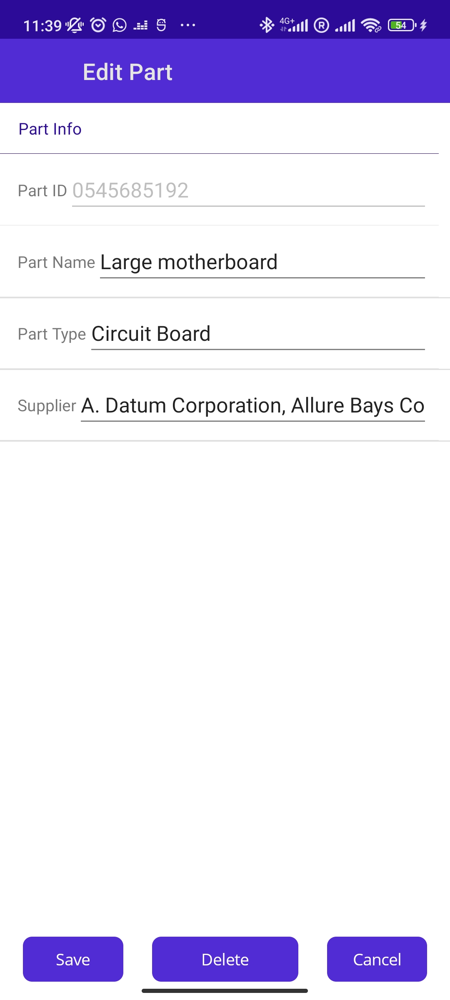
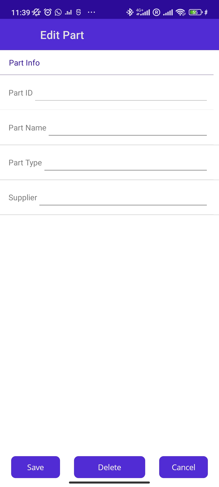
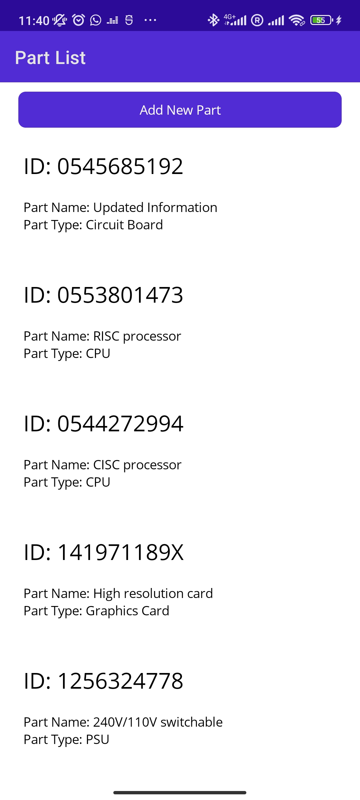
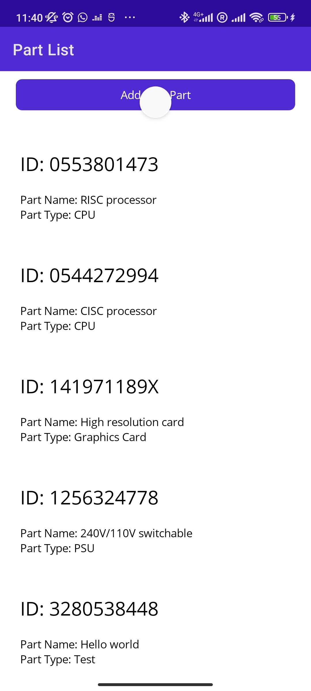
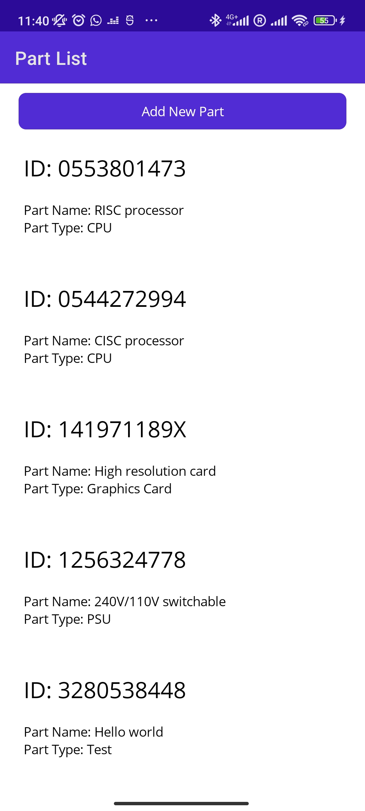

### Hugo FRANGIAMONE
### 2023-03-09

# Assignment 2
## Framework programming

[Link of the exercise 1](https://learn.microsoft.com/en-us/training/modules/consume-rest-services-maui/5-exercise-consume-rest-web-service)
[Link of the ercise 2](https://learn.microsoft.com/en-us/training/modules/store-local-data/6-exercise-use-sqlite-asynchronously)

### 1. Introduction
This exercise is about consuming a REST web service and storing data. The goal is to create a mobile application that displays a list of items from a REST web service and allows the user to add new items to the list. The application will also store the list of items.

### 2. Exercise 1: Consume a REST web service
In this exercise, you will create a mobile application that displays a list of items from a REST web service. The application will also store the list of items.

When launching the app we can see the list of items from the REST web service. We can also add new items to the list. When clicking on an item we can see the details of the item and we can modify them. Hitting the save button will update the item in the list and in the database. We can also delete an item by clicking on the delete button.

### 3. Exercise 2: Store data 

Due to visual studio rufusing to load the dependancy of the project, I hav' not been able to test the exercise 2. I have tried to fix the problem but I have not been able to do so. 
My biggest apologies for this.